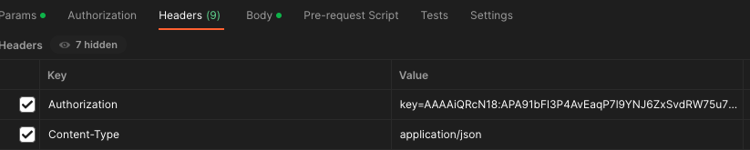

# Postman 으로 FCM 알림 테스트하기

```
POST https://fcm.googleapis.com/fcm/send
```

위 경로로 메세지를 보낸다.



헤더 데이터
* Authorization : key=AAAXXXXXX
* Content-Type : application/json

`Authorization` 은 `key=서버키` 형태로 넣는다.

```json
{
    "to":"FCMToken",
    "data" : {
      "title":"제목",
      "body":"내용",
	  "otherKey":"asdf",
    }
}
```

body 는 정해진 데이터대로 넣는다.


